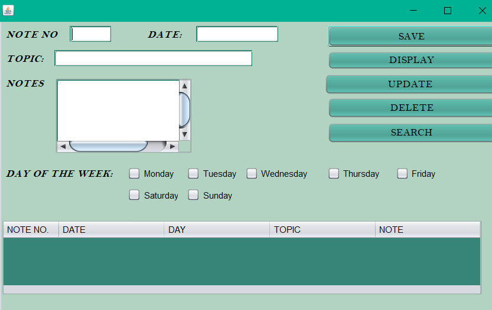
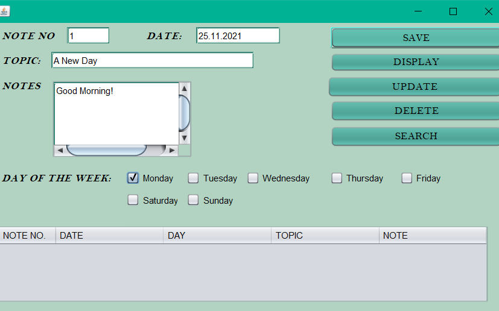
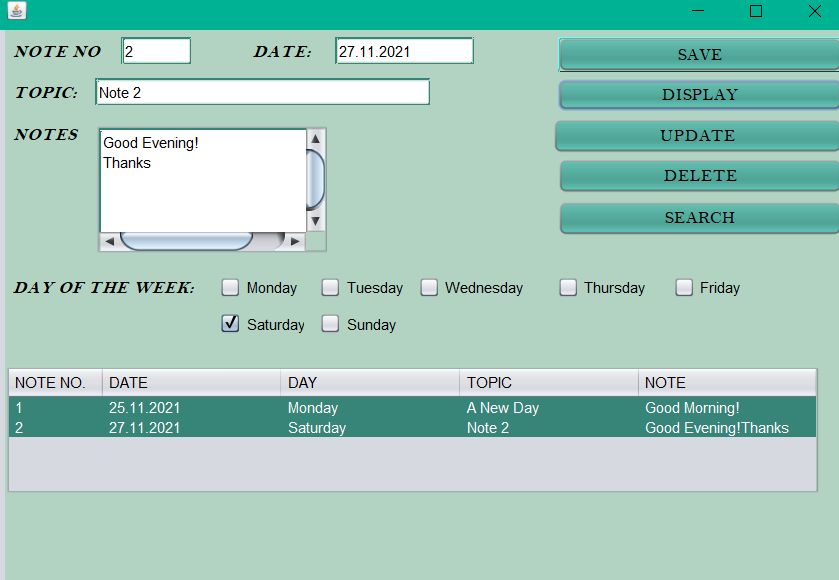
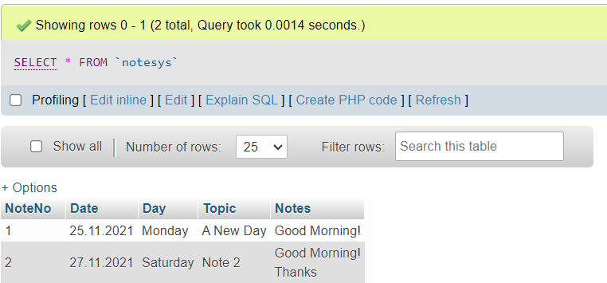
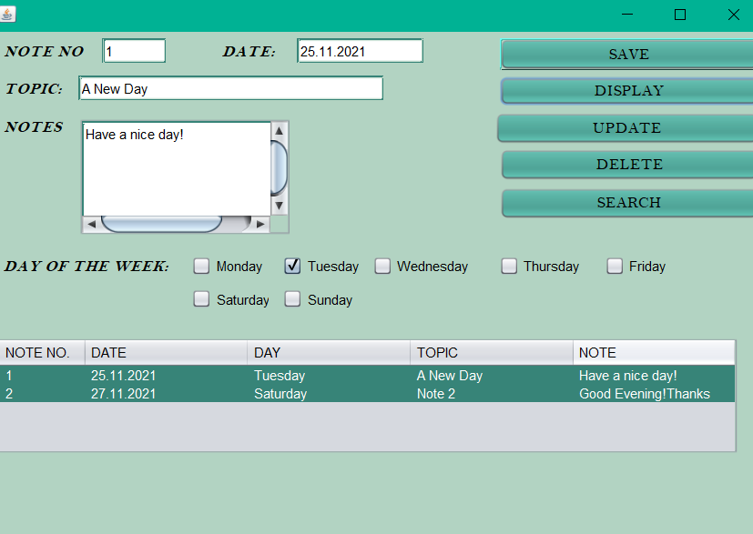
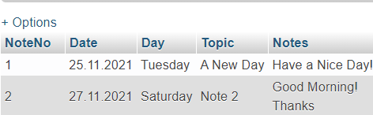
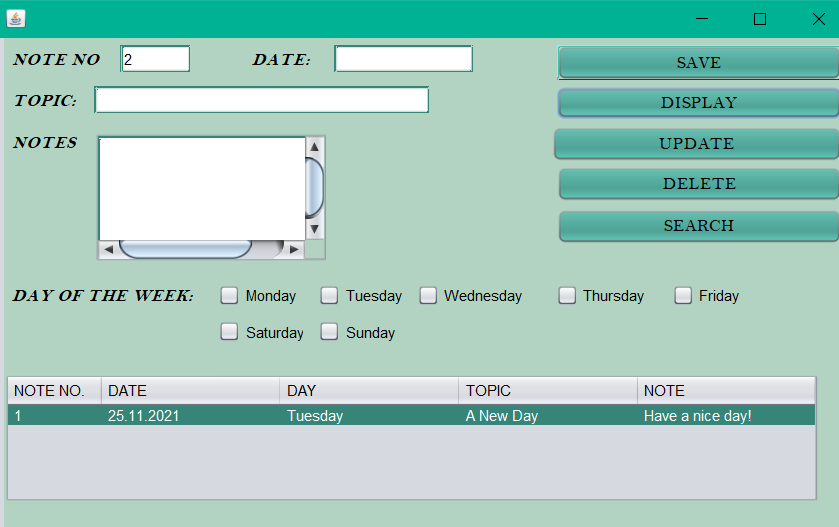

# ENotes-System
This is a E-Notes System, I have created (taking reference of the regular notes application we have in our android/ios smart phones) using JFrame, MySQL Database, Apache  NetBeans IDE. 
  ## Screenshots:
  **1. The main window**
  >
  
  **2. Inserting a Note**
  >
  
  **3. Displaying the Entered Information.**
  >
  
  *Database Connectivity showing the inserted notes*
  >
  
  **4. Updating the Note already entered with Note No as a reference point.**
  >
  
  *Database Connectivity showing the Update entered.*
  >
  
  **5. Deleting an already existing Note** 
  >
  
  *Database Connectivity showing the Database after Deleting the Note stored in the Note No entered.*
  >